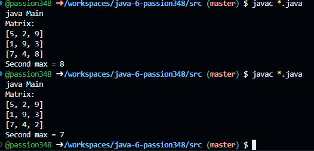

# Практична робота "Поглиблене використання масивів"

Виконав: Гіріч Євгеній, 34 група

## В рамках практичної роботи я зробив наступне:

### 1. Обрав завдання із списку:

№ 4. Знайти друге за величиною число у матриці розміром N x M 

- [Тут код основного класу](src/Matrixwork.java)
- [Тут код тестового класу](src/Main.java)

## Тест

